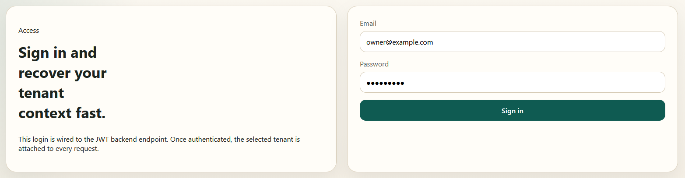
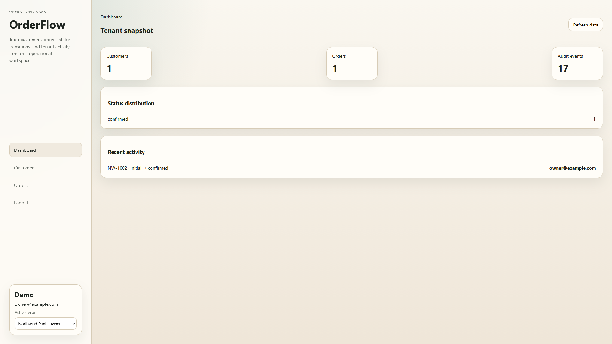
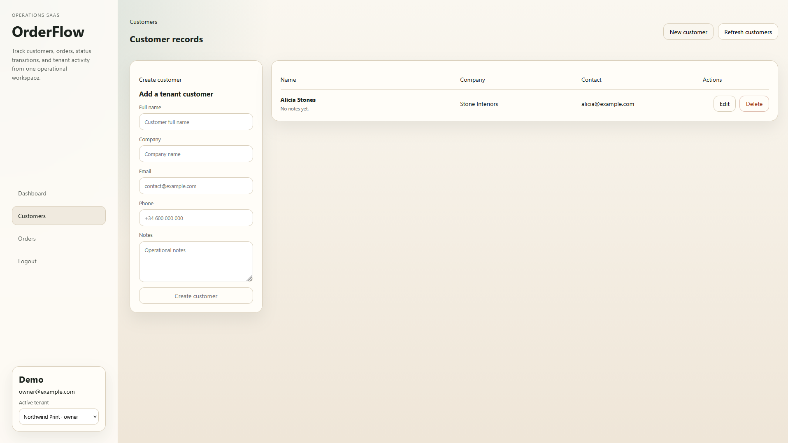
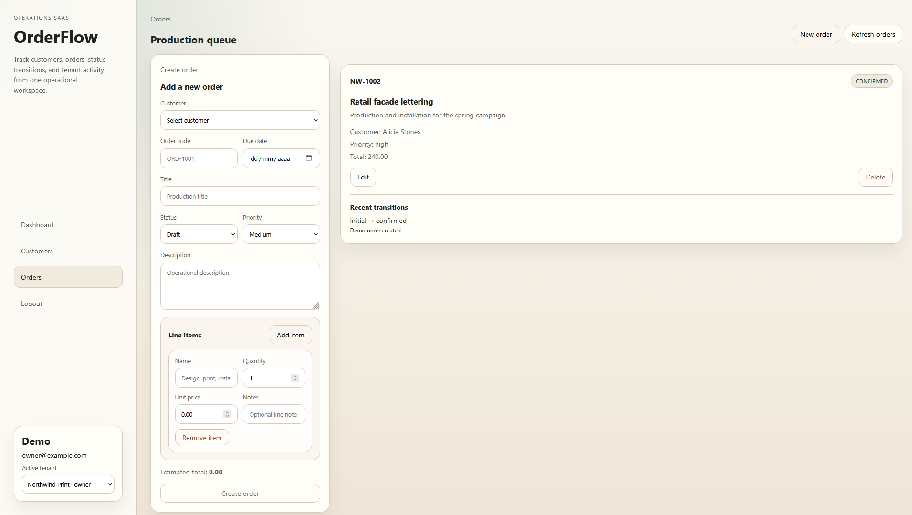

# OrderFlow SaaS

Multi-tenant order management SaaS planned as a production-style full-stack project.

## Repository Role

This directory is the only project repository.

- All source code, branches, commits, merges, and future pushes must happen from this directory.
- Keep code, documentation, and automation self-contained inside this directory.
- Avoid dependencies on files outside this repository.

## Goal

Build a client-facing platform for managing orders, statuses, notifications, reporting, and tenant-level isolation using Django REST Framework, Angular, PostgreSQL, Redis, Celery, and Docker.

## Planned Stack

- Backend: Python, Django, Django REST Framework
- Frontend: Angular, TypeScript
- Database: PostgreSQL
- Async jobs: Celery + Redis
- Infrastructure: Docker Compose, Nginx
- Testing: pytest, Django test framework, Jasmine/Karma

## Repository Layout

- `backend/`: Django API and domain logic
- `frontend/`: Angular SPA
- `infra/`: Docker, reverse proxy, deployment assets
- `docs/`: Architecture, API design, roadmap, workflows

## Documentation Index

- `docs/vision.md`
- `docs/architecture.md`
- `docs/domain-model.md`
- `docs/api-plan.md`
- `docs/frontend-plan.md`
- `docs/deployment.md`
- `docs/roadmap.md`
- `docs/workflow.md`
- `docs/git-workflow.md`
- `docs/development-standards.md`
- `docs/portfolio-summary.md`
- `docs/repository-boundary.md`

## First Delivery Scope

The first version will support:

- Tenant-aware authentication and role-based access
- Customer and order management
- Order timeline and status transitions
- Search, filtering, pagination, and reporting
- Async notifications and audit logging
- Dockerized local development and reproducible validation commands

## Current Foundation

The repository already includes:

- Django REST API with JWT authentication by email
- Tenant, membership, customer, order, order item, status history, and audit models
- REST endpoints for auth, current tenant, memberships, customers, orders, transitions, and dashboard summary
- Local SQLite workflow with migrations and demo seed command
- Angular standalone frontend with login, dashboard, customers, and orders CRUD workflows
- Dockerfiles for backend and frontend, plus a Compose stack for PostgreSQL, Redis, backend, worker, Angular dev tooling, and frontend preview
- Local validation commands for backend checks, tests, frontend typecheck, tests, and production build
- Runtime frontend API configuration, Docker proxying, and backend health endpoint for operations readiness
- Backend container startup now applies migrations and static collection before serving through Gunicorn
- Local Docker backend startup also seeds the documented demo account automatically

## Product Highlights

- Customer CRUD from the Angular UI with validation, edit mode, delete flow, and server-backed feedback states
- Order CRUD from the Angular UI with nested line items, estimated totals, edit mode, delete flow, and state transitions with notes
- Session restore, route guards, JWT refresh, active tenant switching, and tenant header propagation
- Backend API tests for tenant scoping, customer lifecycle, order totals, and status transitions
- Frontend unit tests running inside the Dockerized Node 25 Alpine workflow

## Screenshots

The following images show the current UI flows included in the demo:

### Login



### Dashboard



### Customers



### Orders



## Tenant Model Explained

A tenant is one company workspace inside the same platform.

- each company has its own tenant record and slug
- users can belong to one or more tenants through memberships
- API requests include `X-Tenant-Slug` to select active company context
- data access is scoped to that tenant so companies do not see each other

For this repository demo, the seed command creates one sample tenant and owner user.

## Public Demo Strategy

For a portfolio-ready public demo, treat this as a controlled B2B sandbox:

- keep a demo tenant with fictional data
- keep registration closed (no open public sign-up)
- expose read and write flows only for demo credentials
- keep production secrets outside the repository
- show architecture and security trade-offs clearly in docs

## Local Start

Backend with local SQLite:

```powershell
python -m venv .venv
.\.venv\Scripts\python -m pip install -r backend\requirements.txt
cd backend
..\.venv\Scripts\python manage.py migrate
..\.venv\Scripts\python manage.py seed_demo
..\.venv\Scripts\python manage.py runserver
```

Demo credentials:

- Email: `owner@example.com`
- Password: `change-me`
- Tenant header: `northwind-print`

Container stack once Docker daemon is available:

```powershell
cd infra
docker compose up --build
```

Helpful operations:

```powershell
cd infra
docker compose ps
docker compose down
docker compose down --volumes
```

That local stack creates the documented demo account automatically on backend startup.

This repository intentionally does not include an automatic demo deployment workflow.

Frontend development through Docker:

```powershell
cd infra
docker compose up frontend
docker compose run --rm frontend npm run typecheck
docker compose run --rm frontend npm test
docker compose run --rm frontend npm run build:prod
docker compose --profile preview up --build frontend-preview
```

Backend validation:

```powershell
cd backend
..\.venv\Scripts\python manage.py test
```

## Status

Core product slice implemented and validated. The repository now demonstrates tenant-aware backend workflows, operational frontend CRUD flows, Docker-based frontend validation on Node 25 Alpine, and portfolio-ready technical documentation.

## Clone And Deploy Handoff

To make this project easy to clone and deploy by third parties:

- copy `.env.example` to a real environment file in the target platform and replace all secrets
- set production hosts and CORS origins for the target domain
- run database migrations before first traffic
- run `seed_demo` only for demo environments
- run the documented validation commands before publishing repository updates
- deploy backend, frontend, PostgreSQL, and Redis using the topology in `infra/docker-compose.yml` as baseline

Deployment details and responsibilities are documented in `docs/deployment.md`.
The same document also includes a production readiness checklist to show the hardening path from demo baseline to real operations.